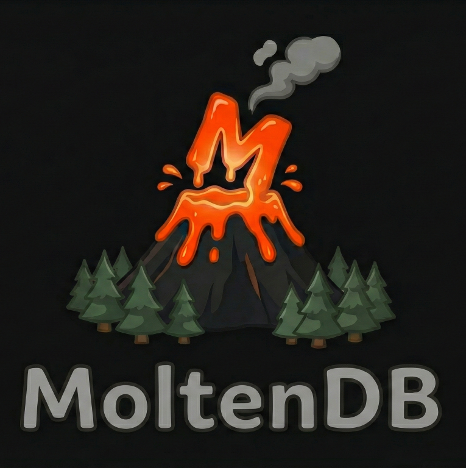

<div align="center">
  

# MoltenDB WASM Demo

### 🌋 Interactive Browser Demo for MoltenDB

**[⚡ Try it Live on StackBlitz](https://stackblitz.com/~/github.com/maximilian27/moltendb-wasm-demo?file=package.json)**

[](https://github.com/maximilian27/MoltenDB/blob/main/LICENSE.md)

</div>

---

## What is this?

This is the interactive demo for [MoltenDB](https://github.com/maximilian27/MoltenDB) — a JSON document database written in Rust that runs directly in your browser via WebAssembly and persists data using the Origin Private File System (OPFS).

The demo provides two explorers to interact with the database engine:

### Raw JSON Explorer
Send plain JSON payloads directly to the WASM engine — the same format used by the HTTP API. Great for understanding the underlying query structure.

### Query Builder Explorer
Use the [`@moltendb-web/query`](https://www.npmjs.com/package/@moltendb-web/query) package to build queries with a type-safe, chainable API. This is the recommended way to interact with MoltenDB in your own projects.

---

## Running Locally

```bash
npm install
npm run dev
```

> **Note:** OPFS requires `SharedArrayBuffer`, which needs the following HTTP headers (already configured in `vite.config.js`):
> ```
> Cross-Origin-Opener-Policy: same-origin
> Cross-Origin-Embedder-Policy: require-corp
> ```

---

## Raw JSON vs Query Builder

Both explorers talk to the same WASM engine. The difference is how you express your queries:

**Raw JSON** — plain request objects sent directly:
```json
{
  "collection": "laptops",
  "where": { "brand": { "$in": ["Apple", "Dell"] }, "in_stock": true },
  "fields": ["brand", "model", "price"],
  "count": 10
}
```

**Query Builder** — chainable API from `@moltendb-web/query`:
```ts
const results = await client.collection('laptops')
  .get()
  .where({ brand: { $in: ['Apple', 'Dell'] }, in_stock: true })
  .fields(['brand', 'model', 'price'])
  .count(10)
  .exec();
```

Both produce identical results — the query builder simply constructs the JSON payload for you with full TypeScript type safety.

---

## Packages Used

- **[`@moltendb-web/core`](https://www.npmjs.com/package/@moltendb-web/core)** — the WASM engine, Web Worker, and main-thread client
- **[`@moltendb-web/query`](https://www.npmjs.com/package/@moltendb-web/query)** — the chainable query builder

---

## License

MIT OR Apache-2.0
